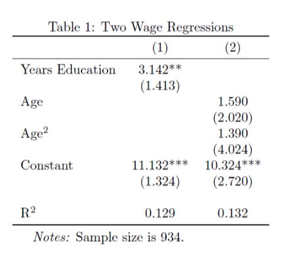

.. currentmodule: econtools

.. _tolatex:

*******************
LaTeX Tools
*******************

.. contents:: :local:

``outreg``
----------

See :py:func:`~econtools.outreg`.

``table_mainrow``
-----------------

See :py:func:`~econtools.table_mainrow`.

``table_statrow``
-----------------

See :py:func:`~econtools.table_statrow`.

``write_notes``
---------------

See :py:func:`~econtools.write_notes`.

Example
-------

.. code-block:: python

    from econtools import read, outreg, table_statrow, write_notes
    import econtools.metrics as mt

    # Load data
    df = read('my_data.dta')

    # Run Regressions
    reg1 = mt.reg(df, 'ln_wage', ['ed'], addcons=True)
    reg2 = mt.reg(df, 'ln_wage', ['age', 'age2'], addcons=True)

    # Put coefficients and standard errors in a table
    regs = (reg1, reg2)
    table_string = outreg(regs,
                          ['ed', 'age', 'age2', '_cons'],     # Add these coefficients to the table
                          ['Years Education',                 # Use these label for the coeffs
                           'Age',
                           'Age$^2$',
                           'Constant']
                          digits=3                            # Round to 3 decimal digits.
                          )

    # Add R^2 to the table
    table_string += "\\\\ \n"                           # Empty line between betas and r2
    table_string += table_statrow("R$^2$"               # Add a row with this label
                                  [x.r2 for x in regs], # Fill the row with these values
                                  digits=3)

    # Save the table string to a file
    results_path = 'my_results.tex'
    with open(results_path) as f:
        f.write(table_string)

    # Save separate file with table notes
    notes = "Sample size is {}.".format(reg1.N)
    write_notes(notes, results_path)

The above snippet of code saves two files to disk, ``my_results.tex``:

.. literalinclude:: my_results.tex
    :language: tex

and ``my_results_notes.tex``:

.. literalinclude:: my_results_notes.tex
    :language: tex

These files can be incorporated into a LaTeX document using the ``\input``
command. In the main LaTeX document:

.. literalinclude:: main.tex
    :language: tex

This results in 

